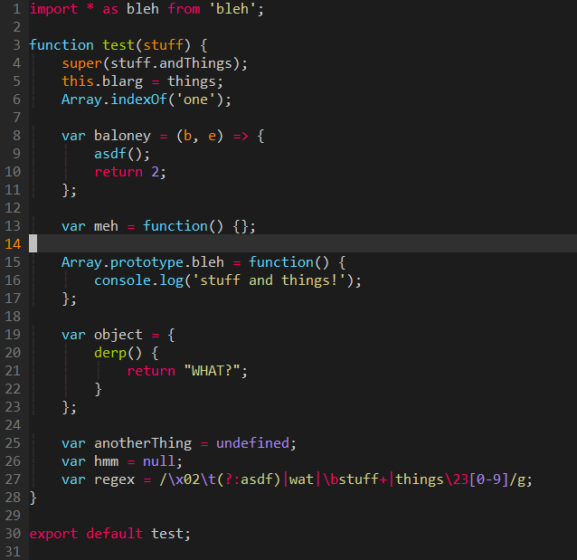
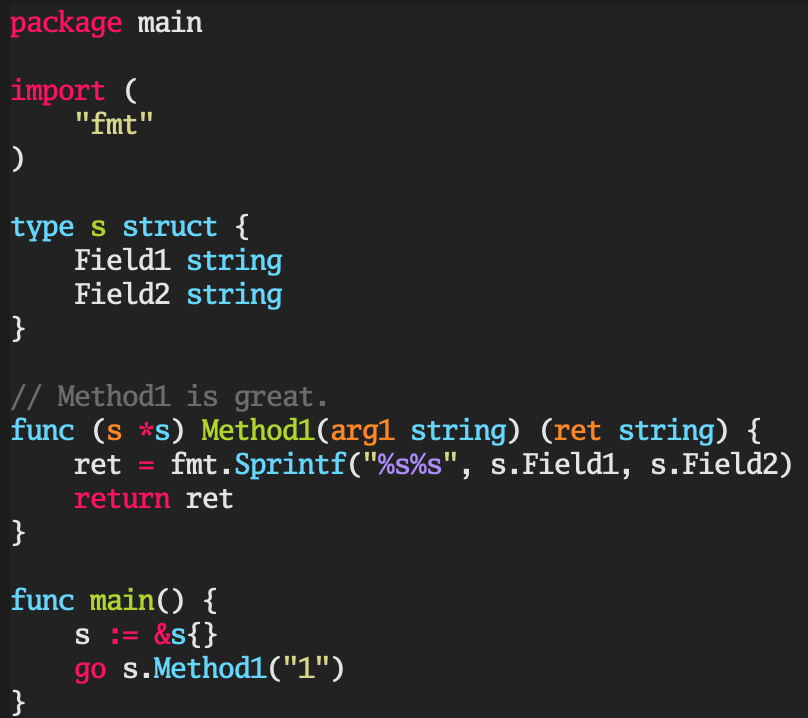
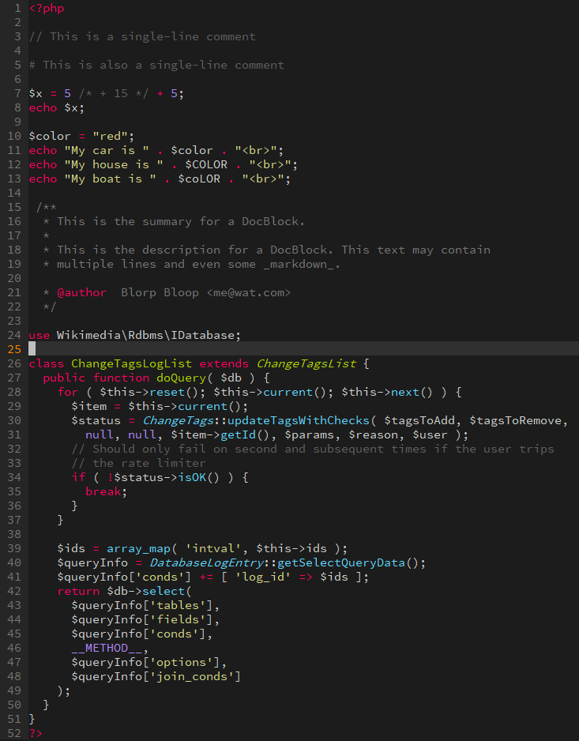

# Sublime Monokai for Vim

Looking for screenshots? Scroll down to see!

`vim-sublime-monokai` is a refined Monokai color scheme for `vim` tries to look
like Sublime's default color scheme. It's derived from the work put into:

* [sickill/vim-monokai](https://github.com/sickill/vim-monokai)
* [crusoexia/vim-monokai](https://github.com/crusoexia/vim-monokai)

I noticed that there were several places where the highlighting wasn't entirely
faithful to that of Sublime, which is my second choice for editing in my
day-to-day. The purpose of this project is to provide an experience that
matches Sublime as closely as possible.

Note that, in my case, I use several plugins to enhance my own highlighting and
`ctags` experience. Where possible, the dependent plugins have been noted for
languages whose highlighting would otherwise be impossible to make equivalent
to Sublime. Conflicts with other plugins that I've used have been noted. You
will NOT get full fidelity with Sublime's highlighting if you use conflicting
plugins with this color scheme enabled.

## Installation

Use your favorite plugin manager! Alternatively, download the
[`colors/sublimemonokai.vim`](https://raw.githubusercontent.com/erichdongubler/vim-sublime-monokai/master/colors/sublimemonokai.vim)
file and move it into your `colors` folder.

## Usage

After installing this plugin via your favorite plugin manager, add the
following to your `vimrc`:

```viml
syntax on
colorscheme sublimemonokai
```

Inside of [`sublimemonokai.vim`](./colors/sublimemonokai.vim) one will find
notes and suggested variations from exact Sublime colors that contributors have
found to be superior to vanilla Sublime. It is recommended that you take a look
and see if there's anything you like! Deficiencies in syntax highlighting
support that make it impossible to achieve parity with Sublime have also been
noted. These are prime candidates for PRs if you find a plugin with better
syntax highlighting groups!

## Terminal support

`vim-sublime-monokai` only support 256 colours in terminal. If you are using a
terminal which support truecolor like **iterm2**, enable the GUI color by
adding the following to your `vimrc`:

```viml
set termguicolors
```

Otherwise, use below setting to activate the 256 color in terminal

```viml
set t_Co=256
```

## Configuration

### Italics

By default italicized text is enabled in GUI (gVim), but in terminal it's not.
If you are using a font that support italics in terminal, add the following
to your `.vimrc`:

```viml
let g:sublimemonokai_term_italic = 1
```

## Language-specific configuration

In order to provide an experience with parity to Sublime, this color scheme
integrates with the highlighting groups that several language-specific plugins
specify. You will need to install these plugins in order to have Sublime-like
highlighting.

### Java

There are two flavors you can pick from here -- see below sections for more
details.

#### Mainline `vim`'s Java


This is the recommended option for Java. You will need at least the following
configuration for proper color support:

```viml
let java_comment_strings=1
let java_highlight_functions=1
let java_highlight_java_lang_ids=1
```

#### Using `vim-java`


1. [`vim-java`](https://github.com/rudes/vim-java) for the core language

### Javascript



1. [`vim-javascript`](https://github.com/pangloss/vim-javascript) for the core
    language
2. [`vim-javascript-lib`](https://github.com/crusoexia/vim-javascript-lib), for
    popular Javascript libraries, like [underscore](http://underscorejs.org/)
    and [Backbone](http://backbonejs.org/).

#### Conflicts with Javascript

* [`cSyntaxAfter`](https://github.com/vim-scripts/cSyntaxAfter) conflicts on
    many operator groups.

### Go



1. [`vim-go`](https://github.com/fatih/vim-go) for the core language

    You will need at least the following configuration for proper color
    support:

    ```viml
    let g:go_highlight_format_strings = 1
    let g:go_highlight_function_arguments = 1
    let g:go_highlight_function_calls = 1
    let g:go_highlight_functions = 1
    let g:go_highlight_operators = 1
    let g:go_highlight_types = 1
    ```

    The following are also provided as options by `vim-go` and are handled
    gracefully:

    ```viml
    let g:go_highlight_extra_types = 1
    let g:go_highlight_fields = 1
    let g:go_highlight_generate_tags = 1
    let g:go_highlight_variable_assignments = 1
    let g:go_highlight_variable_declarations = 1
    ```

    This should cover all options provided by `vim-go` pertaining to
    highlighting. If you notice that this is out-of-date, please submit a PR!

### PHP



1. [`StanAngeloff/php.vim`](https://github.com/StanAngeloff/php.vim) for the
    core language

    You will need at least the following configuration for proper color
    support:

    ```viml
    let g:php_var_selector_is_identifier = 1
    ```

## Other Screenshots

### HTML


